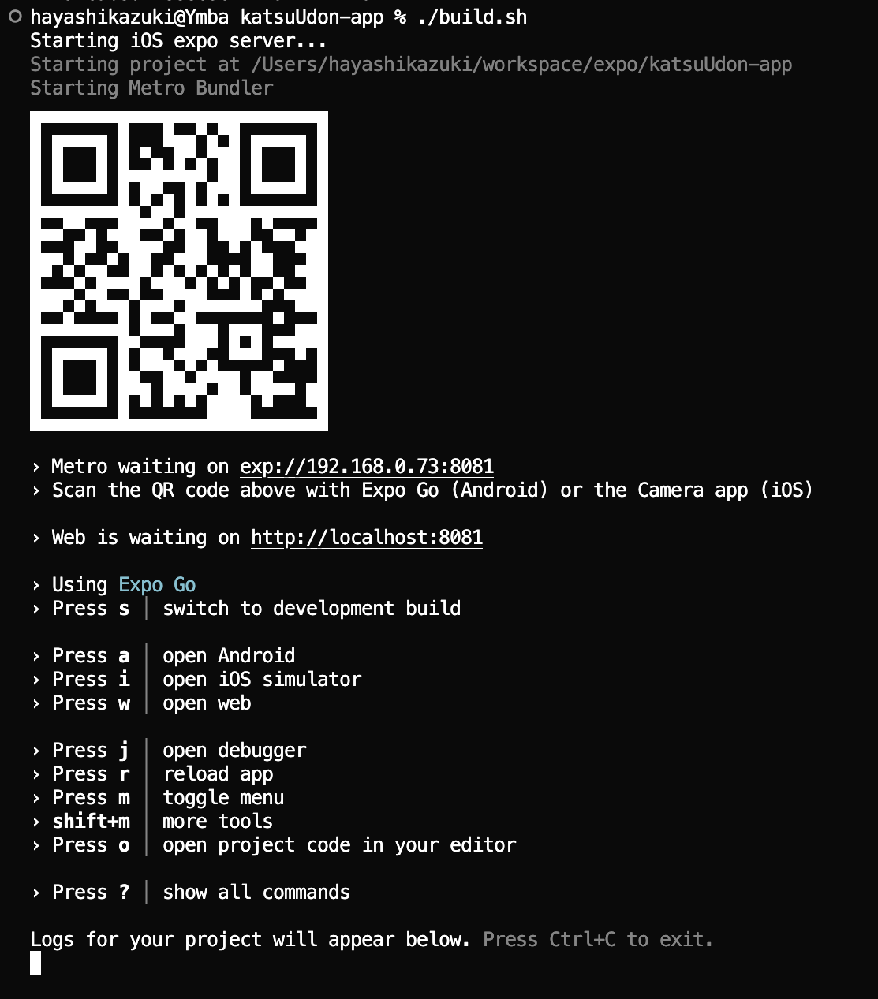

# Workspace-katsuUdon


## ⚒️ 開発用ビルド
### OSによって下記コマンドで実行

```bash
# Windows
.\build.bat

# Mac 
./build.sh
```

**QRコードをスキャン**
   - build.sh/build.bat ファイルを実行後に表示される **QRコードをスキャン or URL(Web is waiting on)** を
      - macの場合は`⌘ + クリック`
      - windowsの場合は`ctrl + クリック`
   - **iPhone or Web** 上で確認


### こんな感じの画面になるはず．．．


## 📥 Pull系


### ⬇️ pull.sh / pull.bat
**developブランチから最新のコードを取得します**

```bash
# Windows
.\pull.bat

# Mac/Linux
./pull.sh
```


---
